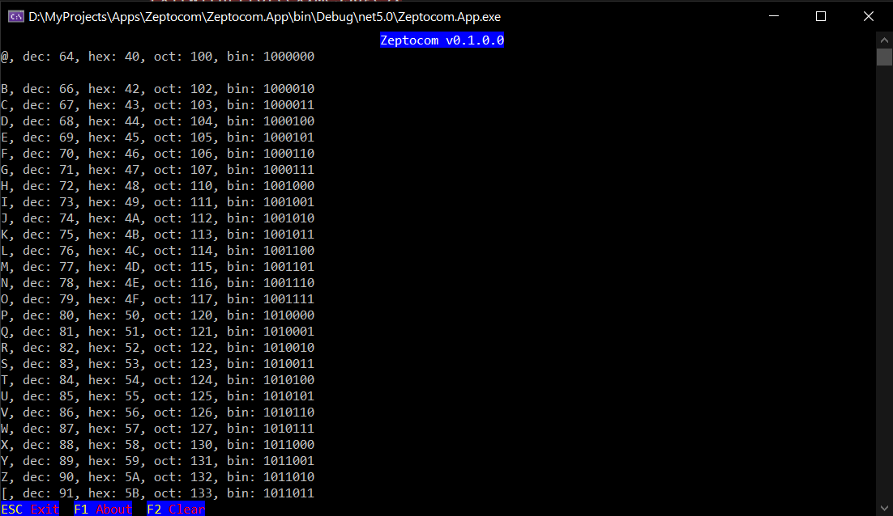

# Zeptocom
> Yet another quick and dirty Serial (COM Port) Console Terminal, Written in .NET 5

[](https://github.com/baget/zeptocom/blob/master/LICENSE)
[](https://GitHub.com/baget/zeptocom/releases/)

This project is development to be quick in order to provide a console Serial terminal that run in Windows Console (command line)
it also support [Windows Terminal](https://github.com/microsoft/terminal)



## Usage example

the application get the COM Port number as parameter and will open it with 115200bps unless changed with ```--baudrate``` switch

``` 
Examples:
1) zeptocom.app.exe COM1 --baudrate 9600
2) zeptocom.app.exe COM4
```

## Development setup

Open in Visual Studio 2019 and build, or compile it from command line

```
cd Zeptocom\Zeptocom.App
dotnet build
dotnet run
```

## Release History

* 0.1.0
    * Work in progress

## Meta

Oren Weil – [@bagetx](https://twitter.com/bagetx)

Distributed under the MTI license. See ``LICENSE`` for more information.

[https://github.com/baget/baget](https://github.com/baget/)

## Contributing

1. Fork it (<https://github.com/baget/zeptocom/fork>)
2. Create your feature branch (`git checkout -b feature/fooBar`)
3. Commit your changes (`git commit -am 'Add some fooBar'`)
4. Push to the branch (`git push origin feature/fooBar`)
5. Create a new Pull Request

[](https://github.com/Naereen/badges)

<!-- Markdown link & img dfn's -->
[wiki]: https://github.com/baget/zeptocom/wiki


